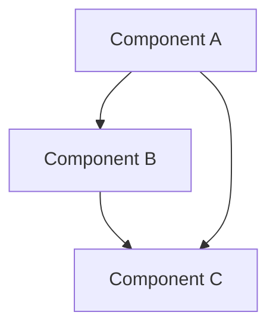

# Nuva OS Module Documentation Standard

**Document ID**: DOC-STANDARD-001
**Version**: 1.1.0
**Created**: 2026-04-03
**Last Updated**: 2026-05-30

---

## 1. Documentation Standard Overview

### 1.1 Goals

- Provide clear, consistent module documentation
- Facilitate developer understanding and code maintenance
- Support automated documentation generation
- Ensure documentation stays in sync with code
- Support bilingual (Chinese/English) documentation system

### 1.2 Documentation Language Rules

| Document Type | Language | Description |
|---------------|----------|-------------|
| Code Comments | English | All code comments must be in English |
| API Docs | English | Rust doc comments in English |
| Architecture Docs | English + Chinese | `.md` English + `_zh.md` Chinese |
| User Docs | English + Chinese | Bilingual versions |
| Commit Messages | English | Git commit messages in English |

---

## 2. Bilingual Documentation Specification

### 2.1 File Naming Rules

| Rule | Description | Example |
|------|-------------|---------|
| English version | Original filename, full English content | `layer-rules.md` |
| Chinese version | Filename with `_zh` suffix, Chinese content | `layer-rules_zh.md` |
| Code blocks | Never translate, keep as-is | See 2.3 |
| Inline code | Never translate, keep as-is | See 2.3 |

### 2.2 Technical Terms Retention in Chinese Documents

The following technical terms **must retain English** in Chinese documents:

| Category | Retained Terms |
|----------|----------------|
| Architecture | HAL, Kernel, Microkernel, IPC, VFS, POSIX, DMA, DMA-BUF |
| Scheduling | CFS, EAS, RT, FIFO, RR |
| Memory | Buddy, SLAB, VMA, NUMA, COW, OOM |
| Security | LSM, ASLR, PQC, Kyber, Dilithium, QRNG, QKD, TEE |
| AI/NPU | NPU, ONNX, DaVinci, tensor, inference |
| Drivers | GPIO, I2C, SPI, IRQ, GIC, PMIC, DVFS |
| Toolchain | Rust, Cargo, nightly, QEMU, CMake |
| Types | trait, struct, enum, Result, Option, Arc |
| Programming | RAII, FFI, ABI, API, DAP, LSP |
| Filesystem | ext4, FAT32, NuvaFS, io_uring |
| Graphics | GPU, Maleoon, compositor |
| Platform | ARM64, AArch64, x86_64, LoongArch64, Kirin, Snapdragon |

### 2.3 Code Block Translation Rules

- **Code blocks** (``` fences): **Never translate**, keep as-is
- **Inline code** (` backticks): **Never translate**, keep as-is
- Code block comments: English in English version, may be Chinese in Chinese version
- Surrounding description text: Translate according to language version

```markdown
<!-- ✅ Correct: code block not translated -->
```rust
pub trait Device: Send + Sync {
    fn name(&self) -> &str;
}
```

<!-- ❌ Wrong: translating code block -->
```rust
pub trait 设备: Send + Sync {
    fn 名称(&self) -> &str;
}
```
```

### 2.4 Consistent Section Structure

Bilingual documents must maintain the same section structure, numbering, and hierarchy:

```markdown
<!-- English version -->
## 3. Module Boundaries

### 3.1 HAL Layer

### 3.2 Kernel Layer

<!-- Chinese version -->
## 三、模块边界

### 3.1 HAL 层

### 3.2 内核层
```

---

## 3. Module Documentation Structure

### 3.1 Module-Level Documentation

Every module must include module-level documentation at the top of `mod.rs` or `lib.rs`:

```rust
/*!
 * Module Name - Brief Description
 *
 * Copyright (C) 2026 Nuva OS Team
 *
 * Detailed description of the module's purpose, architecture,
 * and key concepts.
 *
 * # Architecture
 *
 * Description of the module's architecture and design.
 *
 * # Key Components
 *
 * - Component1: Description
 * - Component2: Description
 *
 * # Usage
 *
 * ```
 * use module::Component;
 *
 * let component = Component::new();
 * ```
 *
 * # Safety
 *
 * Safety considerations and invariants.
 *
 * # Performance
 *
 * Performance characteristics and trade-offs.
 */
```

### 3.2 Struct and Enum Documentation

```rust
/**
 * StructName - Brief description
 *
 * Detailed description of the struct's purpose and usage.
 *
 * # Fields
 *
 * - `field1`: Description of field1
 * - `field2`: Description of field2
 *
 * # Examples
 *
 * ```
 * let instance = StructName {
 *     field1: value1,
 *     field2: value2,
 * };
 * ```
 *
 * # Safety
 *
 * Safety invariants that must be maintained.
 */
#[derive(Debug, Clone)]
pub struct StructName {
    /** Description of field1 */
    pub field1: Type1,

    /** Description of field2 */
    pub field2: Type2,
}
```

### 3.3 Function Documentation

```rust
/**
 * Function name - Brief description
 *
 * Detailed description of what the function does.
 *
 * # Arguments
 *
 * * `arg1` - Description of arg1
 * * `arg2` - Description of arg2
 *
 * # Returns
 *
 * Description of return value.
 *
 * # Errors
 *
 * Description of possible errors.
 *
 * # Examples
 *
 * ```
 * let result = function_name(arg1, arg2)?;
 * ```
 *
 * # Safety
 *
 * Safety requirements (if unsafe).
 *
 * # Performance
 *
 * Performance characteristics (if notable).
 */
pub fn function_name(arg1: Type1, arg2: Type2) -> Result<ReturnType, Error> {
    // Implementation
}
```

### 3.4 Trait Documentation

```rust
/**
 * TraitName - Brief description
 *
 * Detailed description of the trait's purpose and contract.
 *
 * # Implementors
 *
 * Types that implement this trait:
 * - `Type1`: Description
 * - `Type2`: Description
 *
 * # Examples
 *
 * ```
 * fn use_trait<T: TraitName>(t: &T) {
 *     t.method();
 * }
 * ```
 */
pub trait TraitName {
    /**
     * Method description
     *
     * # Arguments
     *
     * * `arg` - Description
     *
     * # Returns
     *
     * Description of return value.
     */
    fn method(&self, arg: Type) -> ReturnType;
}
```

---

## 4. Documentation Section Standards

### 4.1 Required Sections

| Section | Scope | Description |
|---------|-------|-------------|
| Brief Description | All | Short description (first line) |
| Detailed Description | All | Detailed explanation |
| Examples | Public API | Usage examples |
| Safety | unsafe code | Safety explanation |

### 4.2 Optional Sections

| Section | Scope | Description |
|---------|-------|-------------|
| Arguments | Functions/Methods | Parameter descriptions |
| Returns | Functions/Methods | Return value description |
| Errors | Returns Result | Error description |
| Performance | Performance-critical | Performance characteristics |
| Panics | May panic | Panic conditions |
| Architecture | Modules | Architecture description |
| Key Components | Modules | Key components |

### 4.3 Section Order

Recommended section order:
1. Brief Description
2. Detailed Description
3. Architecture (modules)
4. Key Components (modules)
5. Arguments (functions)
6. Returns (functions)
7. Errors (functions)
8. Examples
9. Safety
10. Performance
11. Panics

---

## 5. Code Comment Standards

### 5.1 Inline Comments

```rust
// Single line comment for simple explanations
let value = 42;

// Multi-line comment for complex explanations
// that require more detail about the logic
// or implementation decisions
let complex = calculate();
```

### 5.2 Block Comments

```rust
/*
 * Block comment for:
 * - Complex algorithms
 * - Important design decisions
 * - Safety invariants
 * - Performance considerations
 */
```

### 5.3 TODO Comments

```rust
// TODO: Description of what needs to be done
// FIXME: Description of what needs to be fixed
// HACK: Description of temporary workaround
// SAFETY: Safety justification for unsafe code
```

### 5.4 Comment Conventions

- ✅ Use complete sentences
- ✅ Capitalize first letter
- ✅ End with period
- ✅ Explain "why" not "what"
- ❌ Avoid redundant comments
- ❌ Avoid commented-out code

---

## 6. Architecture Document Standards

### 6.1 Architecture Document Structure

```markdown
# Module Name

**Document ID**: ARCH-XXX-001
**Version**: 1.0.0
**Created**: YYYY-MM-DD
**Last Updated**: YYYY-MM-DD

---

## 1. Overview

Module introduction and goals.

## 2. Architecture Design

### 2.1 Architecture Diagram

Diagrams and descriptions.

### 2.2 Key Components

Component list and responsibilities.

### 2.3 Data Flow

Data flow diagrams and descriptions.

## 3. Interface Design

### 3.1 Public API

API list and descriptions.

### 3.2 Internal Interfaces

Internal interface descriptions.

## 4. Implementation Details

### 4.1 Key Algorithms

Algorithm descriptions and complexity.

### 4.2 Data Structures

Data structure descriptions.

## 5. Performance Considerations

Performance characteristics and optimization strategies.

## 6. Security Considerations

Security analysis and measures.

## 7. Testing Strategy

Testing methods and coverage.

## 8. Usage Examples

Usage examples and best practices.
```

### 6.2 Architecture Diagram Standard

Use Mermaid format:

```markdown
## Architecture Diagram


```

---

## 7. Documentation Generation

### 7.1 Rust Documentation Generation

```bash
# Generate docs
cargo doc --no-deps --open

# Generate private items docs
cargo doc --document-private-items

# Specify output directory
cargo doc --target-dir ./docs/api
```

### 7.2 Documentation Configuration

In `Cargo.toml`:

```toml
[package.metadata.docs]
rs-doc-args = ["--enable-index-page"]
```

### 7.3 Documentation Website

Use mdBook to generate documentation website:

```bash
# Install mdBook
cargo install mdbook

# Initialize docs
mdbook init docs

# Build docs
mdbook build docs

# Serve docs
mdbook serve docs
```

---

## 8. Documentation Review Checklist

### 8.1 Code Documentation Review

- [ ] All public APIs have documentation comments
- [ ] Documentation comments in English
- [ ] Include usage examples
- [ ] unsafe code has Safety explanation
- [ ] Error handling has Errors explanation
- [ ] Performance-critical code has Performance explanation

### 8.2 Architecture Documentation Review

- [ ] Module has architecture documentation
- [ ] Bilingual versions available (`.md` + `_zh.md`)
- [ ] Includes architecture diagrams
- [ ] Includes interface descriptions
- [ ] Includes usage examples
- [ ] Documentation in sync with code

### 8.3 Documentation Quality Review

- [ ] Documentation is clear and understandable
- [ ] Examples are runnable
- [ ] No spelling errors
- [ ] Consistent formatting
- [ ] Links are valid
- [ ] Bilingual structure is consistent
- [ ] Technical terms retained correctly
- [ ] Code blocks not translated
- [ ] Update date filled in

---

## 9. Document Templates

### 9.1 Module Document Template

See `docs/templates/module-template.md` (English) and `docs/templates/module-template_zh.md` (Chinese)

### 9.2 API Document Template

See `docs/templates/api-template.md`

### 9.3 Architecture Document Template

See `docs/templates/architecture-template.md`

---

## 10. Automation Tools

### 10.1 Documentation Check Tools

```bash
# Check for missing docs
cargo clippy -- -W missing_docs

# Check doc examples
cargo test --doc
```

### 10.2 Documentation Generation Script

See `scripts/generate-docs.sh`

---

## 11. Best Practices

### 11.1 Documentation Writing

1. **Document first, code second**: Documentation-driven development
2. **Keep it concise**: Avoid redundancy and repetition
3. **Provide examples**: Examples speak louder than words
4. **Update promptly**: Update docs when code changes

### 11.2 Documentation Maintenance

1. **Regular review**: Ensure docs stay in sync with code
2. **Automated checks**: Use CI for documentation checks
3. **User feedback**: Improve docs based on feedback
4. **Version control**: Version docs alongside code

### 11.3 Bilingual Documentation Maintenance

1. **Synchronized updates**: Modify both language versions simultaneously
2. **Consistent structure**: Maintain the same section structure
3. **Unified terminology**: Use the consistent technical terms retention list
4. **Cross-references**: Provide bilingual links in indexes

---

**Document Status**: Defined
**Implementation Status**: Bilingual specification established
**Next Step**: Add bilingual versions for all existing documents
