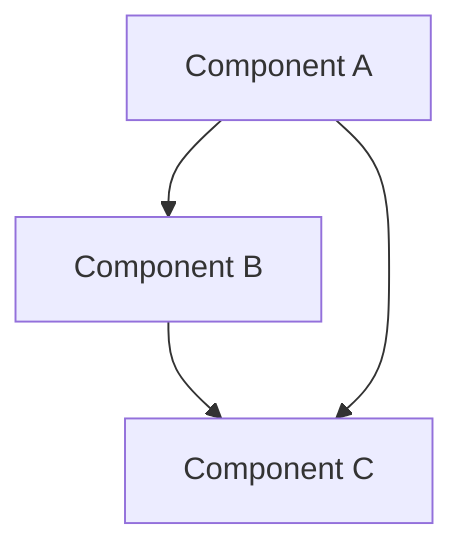

# Nuva OS 模块文档标准

**文档编号**: DOC-STANDARD-001
**版本**: 1.1.0
**创建日期**: 2026-04-03
**最后更新**: 2026-05-30

---

## 一、文档标准概述

### 1.1 目标

- 提供清晰、一致的模块文档
- 便于开发者理解和维护代码
- 支持自动化文档生成
- 确保文档与代码同步
- 支持双语（中文/英文）文档体系

### 1.2 文档语言规范

| 文档类型 | 语言 | 说明 |
|----------|------|------|
| 代码注释 | 英文 | 所有代码注释必须使用英文 |
| API 文档 | 英文 | Rust doc comments 使用英文 |
| 架构文档 | 英文 + 中文 | `.md` 英文版 + `_zh.md` 中文版 |
| 用户文档 | 中文 + 英文 | 双语版本 |
| 提交信息 | 英文 | Git commit message 使用英文 |

---

## 二、双语文档规范

### 2.1 文件命名规则

| 规则 | 说明 | 示例 |
|------|------|------|
| 英文版 | 原文件名，全英文正文 | `layer-rules.md` |
| 中文版 | 文件名加 `_zh` 后缀，中文正文 | `layer-rules_zh.md` |
| 代码块 | 不翻译，保持原样 | 见 2.3 节 |
| 行内代码 | 不翻译，保持原样 | 见 2.3 节 |

### 2.2 中文版技术术语保留规则

以下技术术语在中文文档中**保留英文原文**，不翻译：

| 类别 | 保留术语 |
|------|----------|
| 架构 | HAL, Kernel, Microkernel, IPC, VFS, POSIX, DMA, DMA-BUF |
| 调度 | CFS, EAS, RT, FIFO, RR |
| 内存 | Buddy, SLAB, VMA, NUMA, COW, OOM |
| 安全 | LSM, ASLR, PQC, Kyber, Dilithium, QRNG, QKD, TEE |
| AI/NPU | NPU, ONNX, DaVinci, tensor, inference |
| 驱动 | GPIO, I2C, SPI, IRQ, GIC, PMIC, DVFS |
| 工具链 | Rust, Cargo, nightly, QEMU, CMake |
| 类型 | trait, struct, enum, Result, Option, Arc |
| 编程 | RAII, FFI, ABI, API, DAP, LSP |
| 文件系统 | ext4, FAT32, NuvaFS, io_uring |
| 图形 | GPU, Maleoon, compositor |
| 平台 | ARM64, AArch64, x86_64, LoongArch64, Kirin, Snapdragon |

### 2.3 代码块翻译规则

- **代码块**（` ``` ` 围栏）：**不翻译**，保持原样
- **行内代码**（`` ` `` 包裹）：**不翻译**，保持原样
- 代码块内注释：英文版英文，中文版可中文
- 代码块前后说明文字：按语言版本翻译

```markdown
<!-- ✅ 正确：代码块不翻译 -->
```rust
pub trait Device: Send + Sync {
    fn name(&self) -> &str;
}
```

<!-- ❌ 错误：翻译代码块 -->
```rust
pub trait 设备: Send + Sync {
    fn 名称(&self) -> &str;
}
```
```

### 2.4 中英文章节结构一致

双语文档必须保持相同的章节结构、编号和层级：

```markdown
<!-- 英文版 -->
## 3. Module Boundaries

### 3.1 HAL Layer

### 3.2 Kernel Layer

<!-- 中文版 -->
## 三、模块边界

### 3.1 HAL 层

### 3.2 内核层
```

---

## 三、模块文档结构

### 3.1 模块级文档

每个模块必须在 `mod.rs` 或 `lib.rs` 开头包含模块级文档：

```rust
/*!
 * Module Name - Brief Description
 *
 * Copyright (C) 2026 Nuva OS Team
 *
 * Detailed description of the module's purpose, architecture,
 * and key concepts.
 *
 * # Architecture
 *
 * Description of the module's architecture and design.
 *
 * # Key Components
 *
 * - Component1: Description
 * - Component2: Description
 *
 * # Usage
 *
 * ```
 * use module::Component;
 *
 * let component = Component::new();
 * ```
 *
 * # Safety
 *
 * Safety considerations and invariants.
 *
 * # Performance
 *
 * Performance characteristics and trade-offs.
 */
```

### 3.2 结构体和枚举文档

```rust
/**
 * StructName - Brief description
 *
 * Detailed description of the struct's purpose and usage.
 *
 * # Fields
 *
 * - `field1`: Description of field1
 * - `field2`: Description of field2
 *
 * # Examples
 *
 * ```
 * let instance = StructName {
 *     field1: value1,
 *     field2: value2,
 * };
 * ```
 *
 * # Safety
 *
 * Safety invariants that must be maintained.
 */
#[derive(Debug, Clone)]
pub struct StructName {
    /** Description of field1 */
    pub field1: Type1,

    /** Description of field2 */
    pub field2: Type2,
}
```

### 3.3 函数文档

```rust
/**
 * Function name - Brief description
 *
 * Detailed description of what the function does.
 *
 * # Arguments
 *
 * * `arg1` - Description of arg1
 * * `arg2` - Description of arg2
 *
 * # Returns
 *
 * Description of return value.
 *
 * # Errors
 *
 * Description of possible errors.
 *
 * # Examples
 *
 * ```
 * let result = function_name(arg1, arg2)?;
 * ```
 *
 * # Safety
 *
 * Safety requirements (if unsafe).
 *
 * # Performance
 *
 * Performance characteristics (if notable).
 */
pub fn function_name(arg1: Type1, arg2: Type2) -> Result<ReturnType, Error> {
    // Implementation
}
```

### 3.4 Trait 文档

```rust
/**
 * TraitName - Brief description
 *
 * Detailed description of the trait's purpose and contract.
 *
 * # Implementors
 *
 * Types that implement this trait:
 * - `Type1`: Description
 * - `Type2`: Description
 *
 * # Examples
 *
 * ```
 * fn use_trait<T: TraitName>(t: &T) {
 *     t.method();
 * }
 * ```
 */
pub trait TraitName {
    /**
     * Method description
     *
     * # Arguments
     *
     * * `arg` - Description
     *
     * # Returns
     *
     * Description of return value.
     */
    fn method(&self, arg: Type) -> ReturnType;
}
```

---

## 四、文档章节标准

### 4.1 必需章节

| 章节 | 适用范围 | 说明 |
|------|----------|------|
| Brief Description | 所有 | 简短描述（第一行） |
| Detailed Description | 所有 | 详细说明 |
| Examples | 公开 API | 使用示例 |
| Safety | unsafe 代码 | 安全性说明 |

### 4.2 可选章节

| 章节 | 适用范围 | 说明 |
|------|----------|------|
| Arguments | 函数/方法 | 参数说明 |
| Returns | 函数/方法 | 返回值说明 |
| Errors | 返回 Result | 错误说明 |
| Performance | 性能关键 | 性能特征 |
| Panics | 可能 panic | Panic 条件 |
| Architecture | 模块 | 架构说明 |
| Key Components | 模块 | 关键组件 |

### 4.3 章节顺序

推荐章节顺序：
1. Brief Description
2. Detailed Description
3. Architecture (模块)
4. Key Components (模块)
5. Arguments (函数)
6. Returns (函数)
7. Errors (函数)
8. Examples
9. Safety
10. Performance
11. Panics

---

## 五、代码注释标准

### 5.1 行内注释

```rust
// Single line comment for simple explanations
let value = 42;

// Multi-line comment for complex explanations
// that require more detail about the logic
// or implementation decisions
let complex = calculate();
```

### 5.2 块注释

```rust
/*
 * Block comment for:
 * - Complex algorithms
 * - Important design decisions
 * - Safety invariants
 * - Performance considerations
 */
```

### 5.3 TODO 注释

```rust
// TODO: Description of what needs to be done
// FIXME: Description of what needs to be fixed
// HACK: Description of temporary workaround
// SAFETY: Safety justification for unsafe code
```

### 5.4 注释规范

- ✅ 使用完整句子
- ✅ 首字母大写
- ✅ 结尾使用句号
- ✅ 解释"为什么"而非"是什么"
- ❌ 避免冗余注释
- ❌ 避免注释掉的代码

---

## 六、架构文档标准

### 6.1 架构文档结构

```markdown
# 模块名称

**文档编号**: ARCH-XXX-001
**版本**: 1.0.0
**创建日期**: YYYY-MM-DD
**最后更新**: YYYY-MM-DD

---

## 一、概述

模块的整体介绍和目标。

## 二、架构设计

### 2.1 架构图

架构图和说明。

### 2.2 关键组件

组件列表和职责。

### 2.3 数据流

数据流图和说明。

## 三、接口设计

### 3.1 公开 API

API 列表和说明。

### 3.2 内部接口

内部接口说明。

## 四、实现细节

### 4.1 关键算法

算法说明和复杂度。

### 4.2 数据结构

数据结构说明。

## 五、性能考虑

性能特征和优化策略。

## 六、安全考虑

安全性分析和措施。

## 七、测试策略

测试方法和覆盖率。

## 八、使用示例

使用示例和最佳实践。
```

### 6.2 架构图标准

使用 Mermaid 格式：

```markdown
## 架构图


```

---

## 七、文档生成

### 7.1 Rust 文档生成

```bash
# 生成文档
cargo doc --no-deps --open

# 生成私有项文档
cargo doc --document-private-items

# 指定输出目录
cargo doc --target-dir ./docs/api
```

### 7.2 文档配置

在 `Cargo.toml` 中配置：

```toml
[package.metadata.docs]
rs-doc-args = ["--enable-index-page"]
```

### 7.3 文档网站

使用 mdBook 生成文档网站：

```bash
# 安装 mdBook
cargo install mdbook

# 初始化文档
mdbook init docs

# 构建文档
mdbook build docs

# 预览文档
mdbook serve docs
```

---

## 八、文档审查清单

### 8.1 代码文档审查

- [ ] 所有公开 API 有文档注释
- [ ] 文档注释使用英文
- [ ] 包含使用示例
- [ ] unsafe 代码有 Safety 说明
- [ ] 错误处理有 Errors 说明
- [ ] 性能关键代码有 Performance 说明

### 8.2 架构文档审查

- [ ] 模块有架构文档
- [ ] 架构文档双语版本齐全（`.md` + `_zh.md`）
- [ ] 包含架构图
- [ ] 包含接口说明
- [ ] 包含使用示例
- [ ] 文档与代码同步

### 8.3 文档质量审查

- [ ] 文档清晰易懂
- [ ] 示例可运行
- [ ] 无拼写错误
- [ ] 格式一致
- [ ] 链接有效
- [ ] 双语结构一致
- [ ] 技术术语保留正确
- [ ] 代码块未翻译
- [ ] 更新日期已填写

---

## 九、文档模板

### 9.1 模块文档模板

见 `docs/templates/module-template.md`（英文）和 `docs/templates/module-template_zh.md`（中文）

### 9.2 API 文档模板

见 `docs/templates/api-template.md`

### 9.3 架构文档模板

见 `docs/templates/architecture-template.md`

---

## 十、自动化工具

### 10.1 文档检查工具

```bash
# 检查缺失文档
cargo clippy -- -W missing_docs

# 检查文档示例
cargo test --doc
```

### 10.2 文档生成脚本

见 `scripts/generate-docs.sh`

---

## 十一、最佳实践

### 11.1 文档编写

1. **先写文档，后写代码**：文档驱动开发
2. **保持简洁**：避免冗余和重复
3. **提供示例**：示例胜过千言万语
4. **及时更新**：代码变更时更新文档

### 11.2 文档维护

1. **定期审查**：确保文档与代码同步
2. **自动化检查**：使用 CI 检查文档
3. **用户反馈**：根据反馈改进文档
4. **版本控制**：文档与代码一起版本控制

### 11.3 双语文档维护

1. **同步更新**：中英文版本同步修改
2. **结构一致**：保持相同章节结构
3. **术语统一**：使用统一的技术术语保留列表
4. **交叉引用**：在索引中提供双语链接

---

**文档状态**: 已定义
**执行状态**: 双语规范已确立
**下一步**: 为所有现有文档补充双语版本
